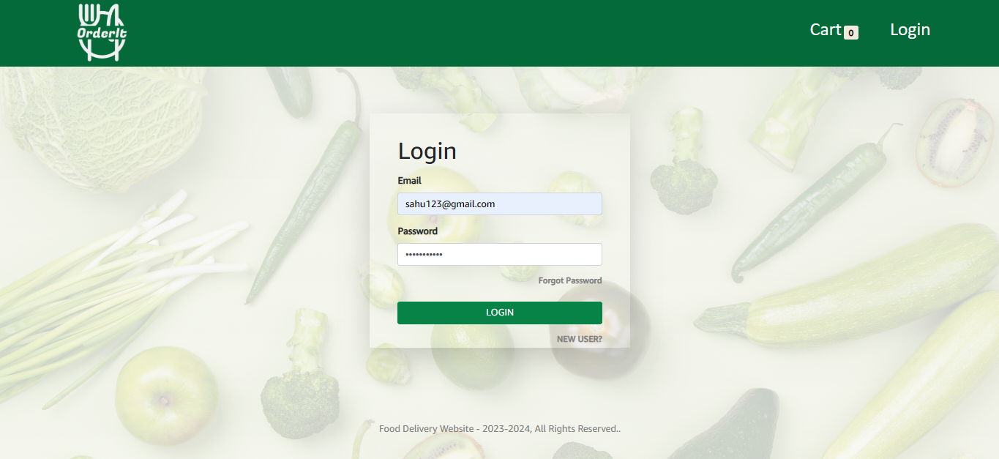
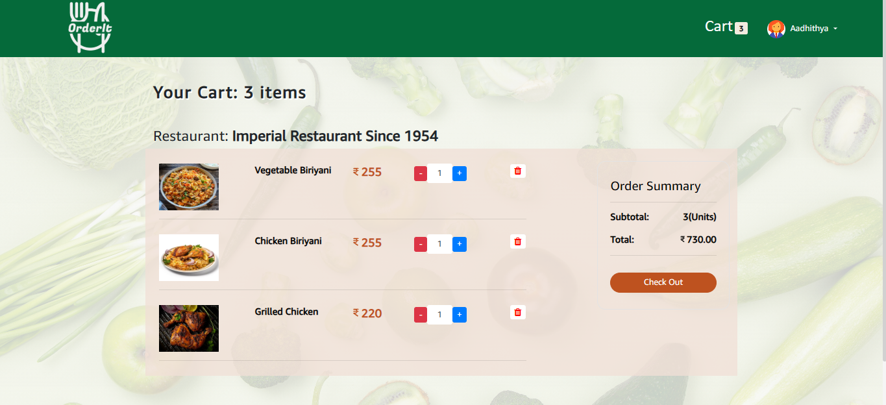
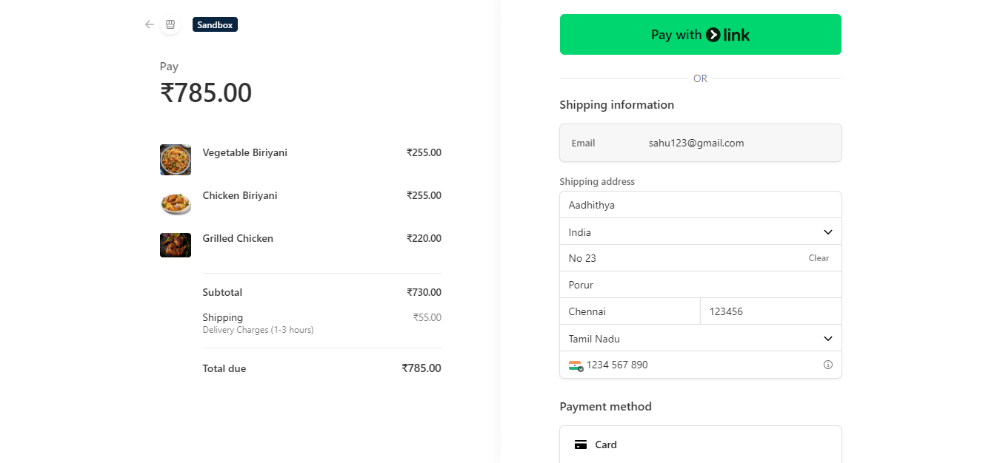
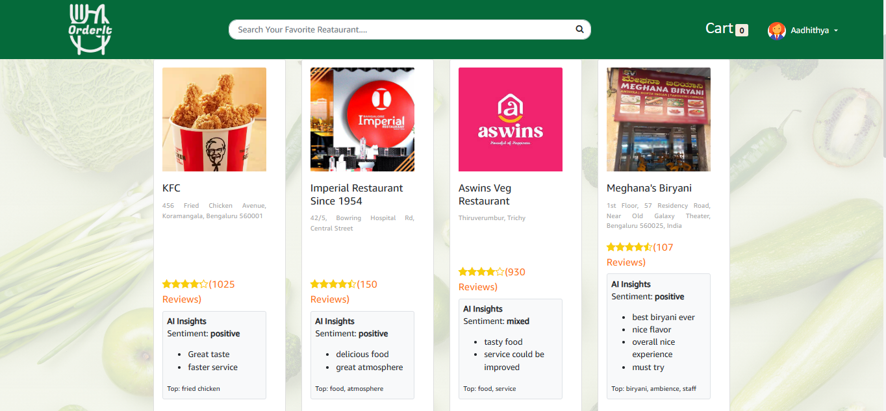
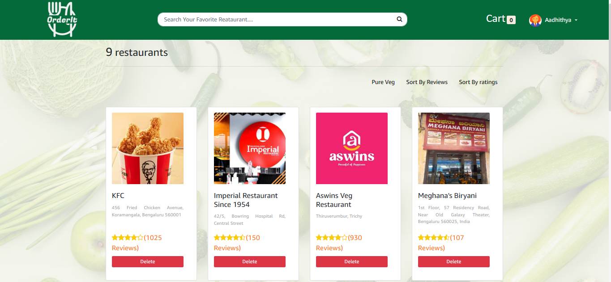

# OrderIt - MERN Food Ordering Platform

## Overview

OrderIt is a full-stack MERN application developed for online food ordering and restaurant management. The platform enables customers to browse menu items, add items to their cart, place orders, make secure online payments, and track their orders through an intuitive interface. It also provides an admin panel for managing menu items, customer orders, and restaurant operations.

The project demonstrates the implementation of a complete food ordering workflow using modern web technologies, including secure authentication, payment integration, cloud-based image management, email notifications, and AI-powered assistance.

---

## Features

### Customer

- User registration and login
- Secure JWT-based authentication
- Browse food menu
- Search food items
- Add and remove items from cart
- Place food orders
- Secure online payment using Stripe
- View order details and order history
- Responsive user interface

### Admin

- Secure admin authentication
- Dashboard for restaurant management
- Add, update, and delete food items
- Upload food images using Cloudinary
- Manage customer orders
- Update order status
- Manage restaurant information

### Payment & Notifications

- Stripe payment gateway integration
- Email notifications using Nodemailer
- Secure payment processing

### AI Features

- AI-powered assistance using the Groq API

---

## Technology Stack

### Frontend

- React.js
- Vite
- Redux Toolkit
- React Router
- Axios
- React Bootstrap
- Styled Components

### Backend

- Node.js
- Express.js
- REST APIs
- JWT Authentication

### Database

- MongoDB
- Mongoose

### Third-Party Services

- Stripe
- Cloudinary
- Nodemailer
- Groq API

---

## Project Structure

```text
OrderIt/
│
├── Backend/
│   ├── config/
│   ├── controllers/
│   ├── middlewares/
│   ├── models/
│   ├── routes/
│   ├── package.json
│   └── server.js
│
├── Frontend/
│   ├── public/
│   ├── src/
│   │   ├── assets/
│   │   ├── Components/
│   │   ├── redux/
│   │   └── utils/
│   ├── package.json
│   └── vite.config.js
│
├── .gitignore
└── README.md
```

---

## Installation

### 1. Clone the repository

```bash
git clone https://github.com/<your-github-username>/OrderIt.git
```

### 2. Navigate to the project directory

```bash
cd OrderIt
```

### 3. Install backend dependencies

```bash
cd Backend
npm install
```

### 4. Install frontend dependencies

```bash
cd ../Frontend
npm install
```

### 5. Configure Environment Variables

Create a `config.env` file inside the `Backend/config` directory and configure the following variables:

```env
PORT=
NODE_ENV=

MONGO_URI=

JWT_SECRET=
JWT_EXPIRE=
JWT_EXPIRES_TIME=

CLOUDINARY_CLOUD_NAME=
CLOUDINARY_API_KEY=
CLOUDINARY_API_SECRET=

EMAIL_USERNAME=
EMAIL_PASSWORD=
EMAIL_HOST=
EMAIL_PORT=
EMAIL_FROM=

FRONTEND_URL=

STRIPE_SECRET_KEY=
STRIPE_API_KEY=

GROQ_API_KEY=
```

### 6. Run the backend

```bash
cd Backend
npm start
```

### 7. Run the frontend

```bash
cd Frontend
npm run dev
```

---

## Screenshots

### Login Page



### Menu


### Cart



### Checkout



### User Dashboard



### Admin Dashboard



---

## Future Improvements

- Real-time order tracking
- Customer reviews and ratings
- Coupon and discount management
- Multiple restaurant support
- Progressive Web App (PWA)
- Advanced analytics dashboard
- AI-powered food recommendations

---

## What I Learned

Through this project, I gained practical experience in:

- Building RESTful APIs using Express.js
- Developing responsive React applications
- State management using Redux Toolkit
- JWT-based authentication and authorization
- MongoDB database design using Mongoose
- Stripe payment gateway integration
- Cloudinary image management
- Email integration using Nodemailer
- AI API integration using Groq
- Building a complete MERN stack application

---

## Author

**Aadhithya Pattabiraman**
